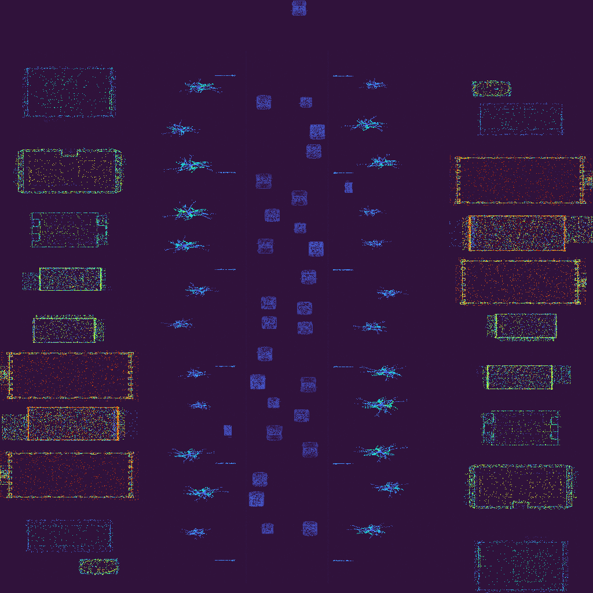
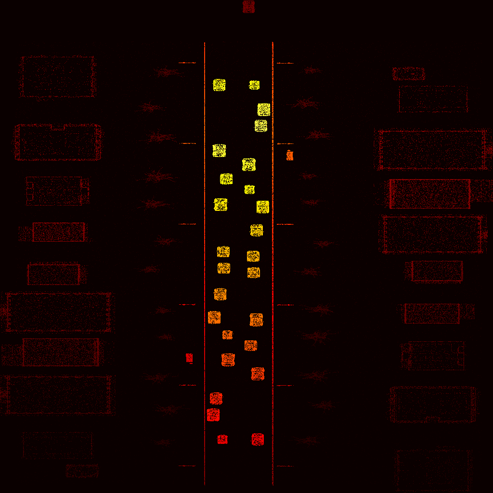

# Synthetic LiDAR Dataset Generator

An **educational synthetic LiDAR dataset** created in Cinema 4D for
research, teaching, and machine learning experiments with 3D point clouds.

The goal of this project is to provide a **reproducible pipeline** for
generating LiDAR-like data with:

- semantic labels (10 classes),
- physics-inspired NIR intensity driven by materials,
- ground-truth annotations suitable for training and evaluating ML models.

This is not a raw data dump — it is a **working instrument**:
you can change the scene, tune materials, add new objects, and re-export
the dataset from scratch.

---

## Preview





<!-- Place your PNG previews in docs/images/ with these names -->

---

## Dataset

Two exported sequences are included:

| Folder | Description |
|---|---|
| `data/frames/`  | scene **without** custom materials |
| `data/frames2/` | scene **with** Legacy materials (NIR-aware) |

Each folder contains:

- `my_lidar_frame_XXXX.bin` — one 20-byte-per-point LiDAR frame,
- `classes.json` — class map + material parameters read from Cinema 4D.

### Semantic classes and colors

| ID | Name     | Color     |
|----|----------|-----------|
| 0  | sensor   | `#ffffff` |
| 1  | vehicle  | `#e6194B` |
| 2  | building | `#3cb44b` |
| 3  | tree     | `#4363d8` |
| 4  | sign     | `#f58231` |
| 5  | road     | `#911eb4` |
| 6  | pole     | `#42d4f4` |
| 7  | person   | `#f032e6` |
| 8  | bike     | `#bfef45` |
| 9  | terrain  | `#9A6324` |

The same mapping is used across all visualizations in the notebook
and the interactive HTML pages.

### Example: `classes.json`

The Python tags in Cinema 4D read the **Roughness** and
**Reflection Strength** from each Matrix Object's material and store
them in `classes.json` next to the exported frames:

```json
{
  "classes_by_id": {
    "0": "sensor",
    "1": "car",
    "2": "building",
    "3": "tree",
    "4": "sign",
    "5": "road",
    "6": "pole",
    "7": "person",
    "8": "bike",
    "9": "terrain"
  },
  "objects_in_scene": {
    "Car_Matrix_LiDAR": 1,
    "Building_Matrix_LiDAR": 2,
    "Tree_Matrix_LiDAR": 3,
    "Road_Matrix_LiDAR": 5,
    "Pole_Matrix_LiDAR": 6,
    "Person_Car_Matrix_LiDAR": 7
  },
  "materials_by_class": {
    "1": [{
      "object": "Car_Matrix_LiDAR",
      "material": "Car",
      "found_on": "obj",
      "roughness": 0.15,
      "reflection_strength": 0.90,
      "reflectance_proxy": 0.833
    }],
    "2": [{
      "object": "Building_Matrix_LiDAR",
      "material": "Building",
      "roughness": 0.85,
      "reflection_strength": 0.40,
      "reflectance_proxy": 0.230
    }]
  },
  "metadata": {
    "export_version": "2.0",
    "has_materials": true,
    "nir_wavelength_nm": 905
  }
}
```

The `reflectance_proxy` is computed as:

    reflectance_proxy = reflection_strength × (1 − 0.5 × roughness)

and the notebook uses it to produce the NIR intensity for each point:

    nir_intensity = reflectance_proxy × (1 − 0.7 × dist_norm)

Full values are in each `classes.json` inside `data/`.

---

## Why this project exists

Real LiDAR datasets are expensive to collect, annotate and distribute.
This project demonstrates how to build a **fully synthetic alternative**
with control over:

- sensor parameters (64 channels, FOV, resolution),
- object materials (roughness, reflectance),
- class semantics,
- motion and camera trajectory,
- NIR-like intensity response.

The result is a small, self-contained pipeline: one Cinema 4D scene,
two Python tags, one Jupyter notebook.

---

## How it works

    Cinema 4D scene (LiDAR.c4d)
         │
         ▼
    Matrix Objects (MoGraph), one per semantic class
         │
         ▼
    Python tags in c4d/
         ├── lidar_export_static.py   →  whole scene at once
         └── lidar_export.py          →  frame by frame
         │
         ▼
    .bin files (20 bytes per point: z, x, y, intensity, class_id)
         │
         ▼
    Jupyter notebook: notebooks/synthetic_lidar_pipeline.ipynb
         │
         ▼
    Plotly 3D animation  +  Matplotlib BEV
         │
         ▼
    Interactive HTML for GitHub Pages

---

## Python tags (Cinema 4D)

Both tags **must be attached to the camera object** and start working
only **after pressing Play on the timeline**.

| Tag | Purpose | Output |
|---|---|---|
| `c4d/lidar_export_static.py` | Exports the **whole scene at once** — a single static snapshot of the entire city. | one `.bin` file per run |
| `c4d/lidar_export.py` | Exports **frame by frame** along the timeline. | `my_lidar_frame_XXXX.bin` for each frame |

Choose the tag depending on what you need:

- **Static** — quick preview, single point cloud, no animation.
- **Animated** — full dataset with motion, used by the notebook
  for animation and BEV.

Both tags write a `classes.json` next to the exported frames, containing
the material information (see the Dataset section above).

---

## Materials and NIR intensity

Each Matrix Object must have a **Legacy material** attached.
The Python tags read two parameters from the material (Reflectance Layer 0):

- **Roughness** — how dull or shiny the surface is,
- **Reflection Strength** — how much light the surface reflects back.

This way you can **control the "brightness"** of any class in the LiDAR
response by simply editing its material in Cinema 4D — no code changes
required.

Example (approximate values from the demo scene):

| Class    | Roughness | Reflection | reflectance_proxy |
|----------|-----------|------------|-------------------|
| vehicle  | 0.15      | 0.90       | 0.83              |
| pole     | 0.30      | 0.85       | 0.72              |
| building | 0.85      | 0.40       | 0.23              |
| person   | 0.70      | 0.30       | 0.20              |
| tree     | 0.95      | 0.20       | 0.11              |
| road     | 0.95      | 0.10       | 0.05              |

The tags write these values into `classes.json` next to the `.bin` frames,
so the notebook can reapply them without touching Cinema 4D again.

---

## Naming rules (important)

Semantic labels are assigned by the **name of the Matrix Object**.
The Python tags split the name by `_` and take the **first token**
as the semantic key.

Correct names:

    Car_Matrix_LiDAR
    Building_Matrix_LiDAR
    Tree_Matrix_LiDAR
    Road_Matrix_LiDAR
    Pole_Matrix_LiDAR
    Person_Car_Matrix_LiDAR

Supported keys (case-insensitive):

    sensor, vehicle, car, building, tree, sign,
    road, pole, person, bike, terrain

If you create a new Matrix Object, **you must follow this convention**,
otherwise the tag will skip it with a warning:

    ❌ Unknown semantic: 'MyObject' (expected <Semantic>_Matrix_LiDAR)

To add a new class, edit the `CLASSES` dict at the top of both Python tags.

---

## Repository structure

    synthetic-lidar-dataset/
    ├── README.md
    ├── LICENSE
    ├── CITATION.cff
    ├── .gitignore
    ├── .gitattributes
    ├── requirements.txt
    ├── c4d/
    │   ├── lidar_export.py            # animated export (frame by frame)
    │   ├── lidar_export_static.py     # static export (whole scene)
    │   └── scene/
    │       ├── LiDAR.c4d
    │       └── README.md
    ├── notebooks/
    │   └── synthetic_lidar_pipeline.ipynb
    ├── data/
    │   ├── frames/
    │   │   ├── my_lidar_frame_*.bin
    │   │   └── classes.json
    │   └── frames2/
    │       ├── my_lidar_frame_*.bin
    │       └── classes.json
    └── docs/
        ├── index.html
        ├── animation_z.html
        ├── animation_nir.html
        ├── animation_z_controls.html
        ├── animation_nir_small.html
        ├── frame_z_0000.html
        ├── frame_nir_0000.html
        ├── frame_z_0000_stats.html
        ├── frame_nir_0000_stats.html
        └── images/
            ├── bev_height.png
            ├── bev_nir.png
            └── scene.png

---

## File format (.bin)

Each frame is a sequence of 20-byte records (little-endian):

| Field     | Type      | Notes                                |
|-----------|-----------|--------------------------------------|
| z         | float32   | exported Z                           |
| x         | float32   | exported X                           |
| y         | float32   | exported Y                           |
| intensity | float32   | 0.0 – 1.0                            |
| class_id  | int32     | 0 = sensor, 1..9 = semantic classes  |

`intensity` in the `.bin` file is a **distance-based placeholder**.
The material-aware NIR intensity is recomputed in the notebook
from `classes.json` + point distances, so the `.bin` files remain
small and reusable.

---

## Adding new objects (workflow)

1. Open `c4d/scene/LiDAR.c4d`.
2. Create a new **Matrix Object** (MoGraph).
3. Name it following the convention: `<Semantic>_Matrix_LiDAR`.
4. Assign a **Legacy material** with custom Roughness and
   Reflection Strength (Reflectance Layer 0).
5. Attach one of the Python tags to the camera:
   - `lidar_export_static.py` — for a one-shot static export,
   - `lidar_export.py` — for frame-by-frame animation.
6. Press Play on the timeline — the tag will start exporting frames.
7. Re-export frames — `frames/` and `classes.json` will be regenerated.
8. Open `notebooks/synthetic_lidar_pipeline.ipynb` and re-run.

No code changes are required to add new objects — only the naming rule
and material assignment matter.

---

## Assets and third-party content

- **3D models** used in the demo scene were downloaded from
  [Sketchfab](https://sketchfab.com/) and are used **strictly for
  non-commercial, educational purposes**.
- All trademarks and copyrights of the original 3D models belong to
  their respective authors.
- The Cinema 4D scene (`c4d/scene/LiDAR.c4d`) is shared as-is for
  educational demonstration only.

---

## Quick start

1. Open the Cinema 4D scene: `c4d/scene/LiDAR.c4d`.
2. Attach one of the Python tags to the camera:
   - `c4d/lidar_export_static.py` — for a single static point cloud,
   - `c4d/lidar_export.py` — for animated frames.
3. Press Play on the timeline — the tag will start exporting frames.
4. Open `notebooks/synthetic_lidar_pipeline.ipynb` and run cells.

---

## Use cases

- Teaching LiDAR principles and semantic segmentation.
- Prototyping ML pipelines before obtaining real data.
- Testing robustness of 3D detectors on synthetic point clouds.
- Visualizing NIR-like material response in point clouds.

---

## License

- **Code:** MIT (see `LICENSE`)
- **Dataset:** CC-BY-4.0 (if applicable)
- **Cinema 4D scene:** included for educational purposes
- **Third-party 3D models:** Sketchfab, non-commercial use only